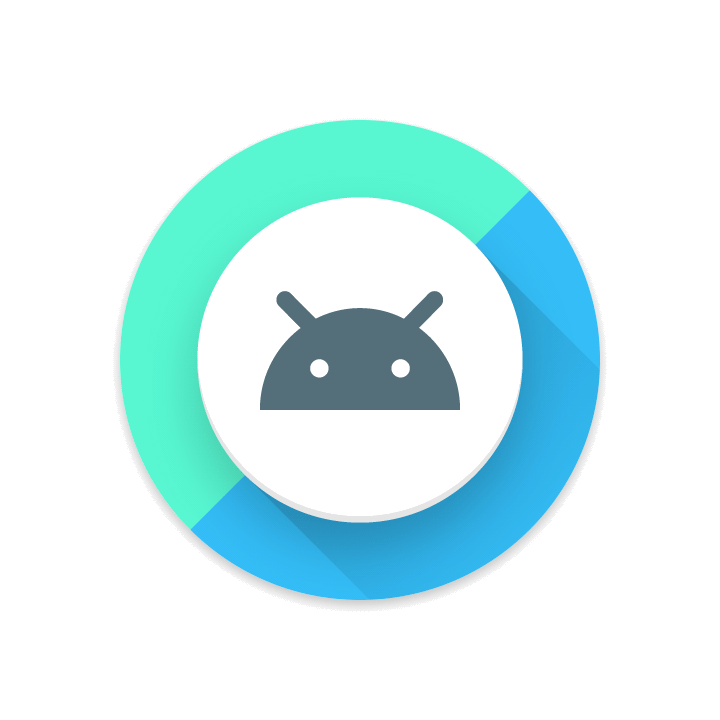
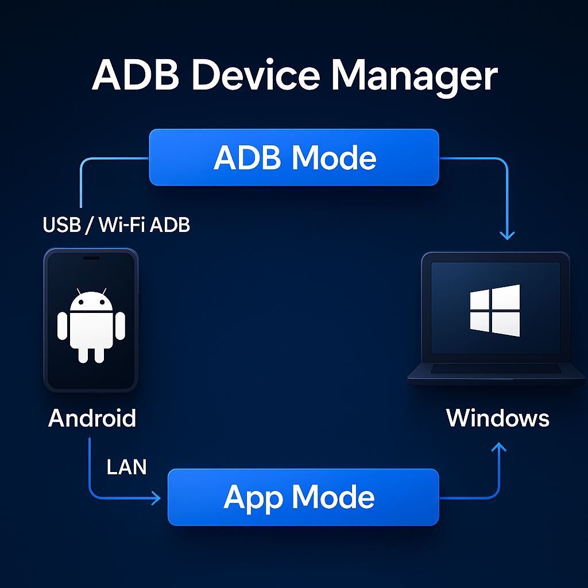
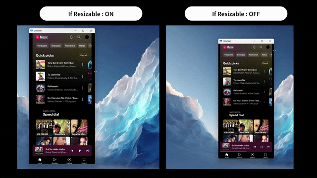

  

  # ADB Device Manager

  **Connect Android & Windows into one seamless control system**

  Built for power users, developers, and Android enthusiasts

  <!-- Tech Badges -->
  
  
  
  
  

--- 

## 🚀 Quick Start

| Platform | Download |
|----------|----------|
| **Windows** | [Download →](https://shrey113.github.io/Adb-Device-Manager-2/windows_download.html) |
| **Linux** | [Coming Soon] |
| **Mac** | [Coming Soon] |
| **Android** | [Download →](https://shrey113.github.io/Adb-Device-Manager-2/android_download.html) |
| **Full Website** | [Visit WebSite →](https://shrey113.github.io/Adb-Device-Manager-2/) |
| **Installation** | [Installation →](https://shrey113.github.io/Adb-Device-Manager-2/docs/installation.html) |
| **Developers** | [Visit For Developers →](https://shrey113.github.io/Adb-Device-Manager-2/pages/Developers.html) |

### For Android Dex (separate project)

| Platform | Download |
|----------|----------|
| **Project** | [Visit project →](https://github.com/Shrey113/Android-Dex) |
| **Windows** | [Download →](https://github.com/Shrey113/Android-Dex/releases/latest/download/android_dex_win.zip) |
| **Linux** | [Download →](https://github.com/Shrey113/Android-Dex/releases/latest/download/android_dex_linux.tar.gz) |
| **Mac** | [Coming Soon] |

---

## ⚡ TL;DR (What This App Does)

ADB Device Manager lets you — using two modes (ADB Mode & App Mode) — do things like:

- Mirror your Android screen Or audio to Windows
- Control apps, notifications, calls & SMS
- Transfer files, browse photos, manage contacts

### 🔐 Security & Privacy

- **No data collection** — we don't track, store, or transmit your personal information
- **Local network only** — all communication stays within your private network
- [VirusTotal Reports (For End Users) →](https://shrey113.github.io/Adb-Device-Manager-2/pages/security_pages/virustotal_reports.html) 

---

## ✨ Overview & Documentation

ADB Device Manager offers **two powerful modes** that work independently or together:

  

### 🧩 ADB Mode  
*System-level control via USB/Wireless debugging*

| Feature | Description |
|---------|-------------|
| [Screen Mirroring](docs/adb/screen-mirroring.md) | Mirror Android screen to Windows |
| [Audio Streaming](docs/adb/audio.md) | Stream device audio to PC |
| [Input Control](docs/adb/input-control.md) | Keyboard & mouse control |
| [Scrcpy Control](docs/adb/scrcpy-control.md) | Customize & manage Scrcpy commands |
| [Android Dex](docs/adb/android-dex.md) | Desktop-style experience |
| [Desktop Mode](docs/adb/desktop-mode.md) | Multi-app virtual display |
| [APK Installer](docs/adb/apk-installer.md) | Install apps via ADB |
| [Camera View](docs/adb/camera.md) | View device camera on PC |
| [Contacts](docs/adb/contacts.md) | Extract contacts via ADB |
| [Call History](docs/adb/call-history.md) | Read call logs |
| [SMS](docs/adb/sms.md) | Extract SMS messages |

### 📱 App Mode  
*Companion app features over Wi-Fi/LAN*

| Feature | Description |
|---------|-------------|
| [Android Streaming](docs/app/android-streaming.md) | Mirror Android screen to Windows |
| [Media Control](docs/app/media-control.md) | Control music playback |
| [Notifications](docs/app/notifications.md) | Real-time notification sync |
| [Photo Gallery](docs/app/photo-gallery.md) | Browse photos wirelessly |
| [File Transfer](docs/app/file-transfer.md) | Fast LAN file transfer |
| [Contacts](docs/app/contacts.md) | Rich UI contact access |
| [Calls](docs/app/calls.md) | Manage calls from Windows |
| [SMS Messages](docs/app/sms.md) | Send/receive SMS |
| [Device Finder](docs/app/device-finder.md) | Auto-discover devices |
| [Bluetooth](docs/app/bluetooth.md) | Bluetooth device tools |
| [Audio Cast Copy](docs/app/audio-cast.md) | Low latency real-time audio casting |
| [TV Control](docs/app/tv-control.md) | Control Android TV & Cast Media |
| [Access Windows/Linux Files](docs/app/access-windows-files.md) | Access Windows/Linux file from Android (Read/Write) |

### 🪟 Windows Integration

| Feature | Description |
|---------|-------------|
| [File Sharing](docs/windows/file-sharing.md) | Browser-based file sharing |
| [Bluetooth Pairing](docs/windows/bluetooth-pairing.md) | Stream audio to Windows |
| [Device Finder](docs/windows/device-finder.md) | Auto-discover connected devices |

### ⌨️ Keyboard Shortcuts

| Shortcut | Action |
|----------|--------|
| `Alt + S` | Screen Mirroring |
| `Alt + A` | Audio Streaming |
| `Alt + Shift + D` | Android DeX |
| `Alt + F` | File Transfer |

📄 [Full shortcut list →](docs/shortcuts.md)

---

## 📊 Comparison

| Feature | ADB Device Manager | Vysor Pro version | Link to Windows |
|--------|:------------------:|:-----:|:----------:|
| Screen Mirroring | **Ultra-low latency** ✅ | ⚠️ Slower | Good ✅ |
| Screen off control | ✅ | Limited ⚠️ | ❌ |
| App-Audio-Only Mirroring | ✅ | ❌ | ✅ |
| Multi-App Desktop Running | ✅ | ❌ | Limited ⚠️ |
| Per-App Audio On/Off | ✅ | ❌ | ❌ |
| Notifications | ✅ | ❌ | ✅ |
| Quick Access | ✅ | ❌ | Limited ⚠️ |
| SMS & Calls sync | ✅ | ❌ | ✅ |
| Remote Camera | ✅ | Limited ⚠️ | ❌ |
| Bluetooth Audio Pairing | ✅ | ❌ | ✅ |
| Full control Without ADB | Limited ⚠️ | ❌ | ✅ |
| Call Audio Capture | ❌ | ❌ | ✅ |

---

## Friendly Links
[escrcpy](https://github.com/viarotel-org/escrcpy)

---

## 🎥 Live Preview: User Favorites

### **Resizable Scrcpy**
*(Experience Android like a Desktop App)*

  

### **Media Sessions**
*(Control Android Audio directly from Windows)*

---

## 🔧 Technologies & Dependencies

A set of tools and frameworks used for ADB communication, screen mirroring, UI rendering, and OS-level integration.

- **[ADB (Android Debug Bridge)](https://developer.android.com/tools/releases/platform-tools)** – Device connection, pairing, and command execution  
- **[scrcpy](https://github.com/Genymobile/scrcpy)** – Android screen mirroring and auto casting over ADB  
- **[nircmd_x64](https://www.nirsoft.net/utils/nircmd.html)** – Windows window control (open, focus, hide, close)  
- **[Flutter](https://flutter.dev/)** – Cross-platform UI for Windows and Android  
- **[Kotlin](https://kotlinlang.org/)** – Android backend and UI logic  
- **[Python](https://www.python.org/)** – Windows backend logic and background services

Thanks to **[rom1v](https://github.com/rom1v)** and **[yume-chan](https://github.com/yume-chan)** for their work and insights that helped deepen understanding of **ADB**, **scrcpy**, and broader real-world use cases around Android device management.

---

## Star History

---
## 🌐 Official Resources

| 📘 Resource | 🔗 Access |
|------------|----------|
| Main Documentation | [Open Docs](https://shrey113.github.io/Adb-Device-Manager-2/Docs.html) |
| Installation Guide | [Install Guide](https://shrey113.github.io/Adb-Device-Manager-2/docs/installation.html) |
| FAQ | [View FAQ](https://shrey113.github.io/Adb-Device-Manager-2/Docs.html#faq) |
| Security & Privacy | [Security Model](https://shrey113.github.io/Adb-Device-Manager-2/security/security_model.html) |
| Transparency | [Transparency Report](https://shrey113.github.io/Adb-Device-Manager-2/security/transparency_model.html) |
| Privacy Policy | [Privacy Policy](https://shrey113.github.io/Adb-Device-Manager-2/security/privacy_policy.html) |
| Troubleshooting | [Fix Issues](https://shrey113.github.io/Adb-Device-Manager-2/Docs.html#troubleshooting) |

---

For more details, visit the [official documentation](https://shrey113.github.io/Adb-Device-Manager-2/Docs.html).

### Thanks for using **ADB Device Manager**!

**Made with ❤️ by [Shrey113](https://github.com/Shrey113)**

